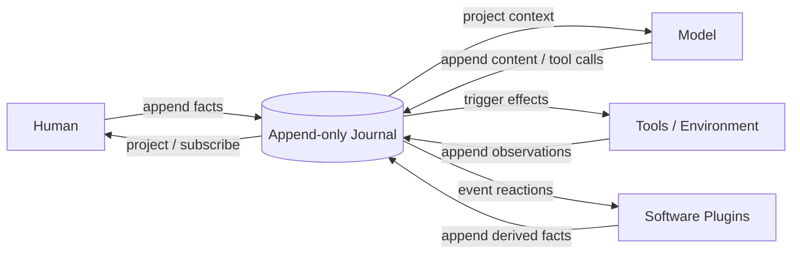
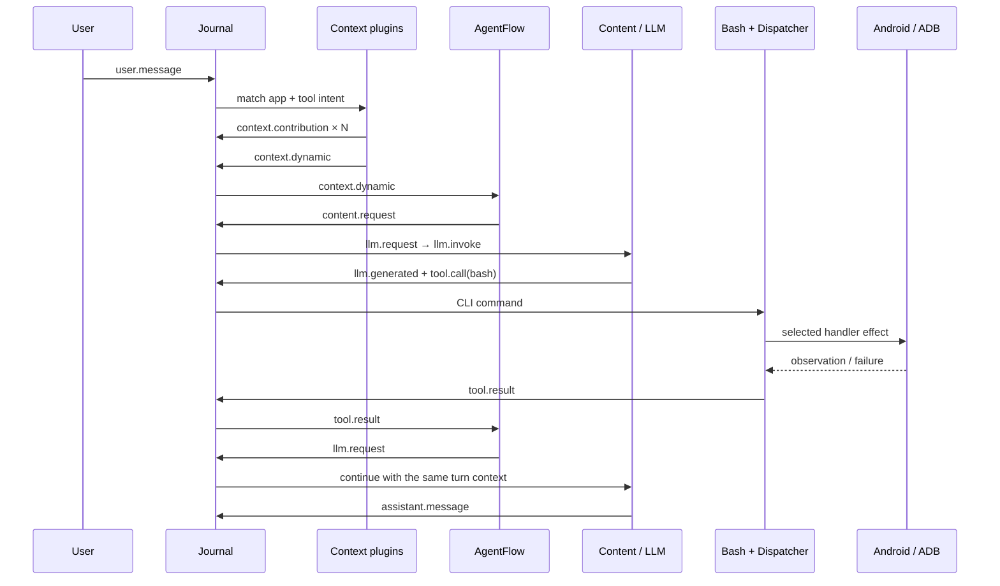
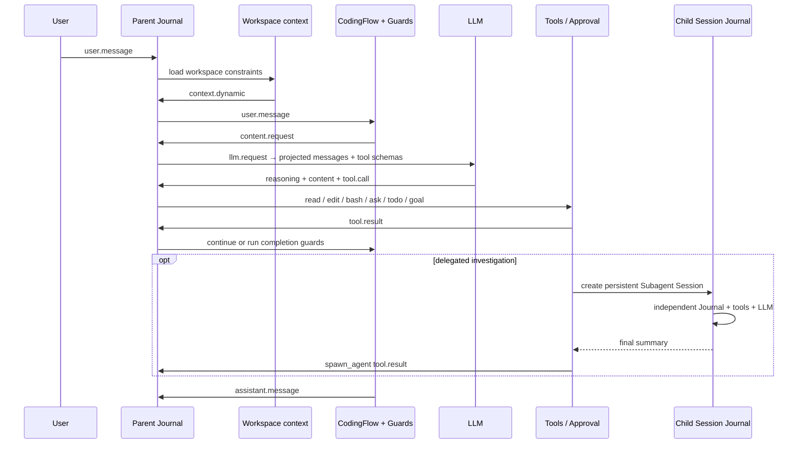

# Knot

**A Journal-first agent runtime and workbench.**

[中文](README.md) · [Core concepts](docs/concepts.md) · [Plugin practices](docs/plugin-best-practices.md)

Humans, models, tools, and software plugins tie facts into one append-only Journal. A plugin reacts to facts that already happened and either appends another fact or stays silent. Their assembly becomes the agent, instead of concentrating every concern in a growing AgentLoop.

> Knot is alpha software. CASE1, CASE2, and Web Run are executable today. The Assembly authoring API, Studio, Case/Eval, and export formats are still being validated and are not frozen public contracts.


## One model



```text
Journal → Projection → Reaction → Effect → Journal
```

- The **Journal** is the authoritative append-only sequence of business facts.
- A **Projection** derives model context, UI, todo state, or metrics without creating another source of truth.
- A **Reaction** subscribes to events and decides whether to append another fact.
- An **Effect** interacts with a model, tool, filesystem, user, or environment and records the completed observation.
- An **Assembly** selects plugins and registration order, producing one concrete agent.

The kernel has no privileged business AgentLoop. Loops may exist, but they emerge from assembled event reactions and stop naturally when no reaction appends another event.

## Why

Complex agent harnesses tend to accumulate prompting, context, tools, permissions, retries, state machines, and UI behavior inside one control loop. The features work, but every change requires understanding the whole system, and failures become difficult to attribute.

Knot organizes the problem differently:

1. Completed business facts enter the Journal.
2. Each plugin owns one explainable reaction or effect boundary.
3. Plugins do not call other plugin implementations; they collaborate through event protocols.
4. Assembly owns semantic relationships, registration order, and completeness.
5. Tests replace providers, tools, or output plugins through assembly.

Observability, testability, replaceability, and local reasoning follow from that model. They are not extra kernel subsystems.

## The entire kernel

[`src/journal.ts`](src/journal.ts) is currently 56 lines, imports nothing, and knows nothing about models, tools, prompts, sessions, storage, trace, or UI.

```ts
type Event = { readonly type: string; readonly data: unknown }
type Handler = (event: Event) => void | Promise<void>
type Plugin = (journal: Journal) => void

interface Journal {
  append(type: string, data: unknown): Event
  read(): readonly Event[]
  subscribe(type: string, handler: Handler): void
}
```

Its current guarantees are append-only facts, at-most-once invocation of each matching subscriber during a normal drain, breadth-first Journal order, serial registration order for subscribers of one event, legal zero-subscriber events, unchanged error propagation, and non-reentrant `runUntilIdle`. A thrown handler aborts that drain immediately; the kernel neither fills missed deliveries nor retries them.

CASE1 and CASE2 use the same kernel without business-specific privileges. See [Core concepts](docs/concepts.md) for the complete model.

## How an agent emerges

One typical tool trajectory is:

```text
user.message
  → context.dynamic
  → content.request
  → llm.request
  → llm.generated
  → tool.call
  → tool.result
  → llm.request
  → assistant.message
```

These arrows are not a built-in workflow. Each step comes from a plugin subscription and its produced facts. Rules, small models, or static sources may replace an LLM as a content source; the model is not the only content-producing role.

Plugins have no direct implementation dependencies, but business preconditions still exist. A `tool.call` needs an executor and an `llm.request` needs a provider. Protocols express relationships; Assembly is responsible for composing a set that works.

## Executable evidence

CASE1 and CASE2 exercise the same kernel from opposite directions. CASE1 is a
high-frequency, short-context agent with a constrained action space. CASE2 is a
long-horizon agent operating in an open environment through many tool calls.
Neither receives a business-specific privilege from the 56-line Journal.

| Case | Real scenario | What it exercises | Result |
|---|---|---|---|
| **CASE1** | Terminal-control assistant driving a USB-connected phone | dynamic tool context, one Bash entry point, a business CLI, pending candidate state, Mock/ADB dispatchers | 66 consecutive requests covered 56 CLI commands; 65/66 followed the expected route; no uncaught error |
| **CASE2** | DeepSeek-driven coding agent | open workspace, approval and interaction, Todo/Goal guards, long tool chains, an independent Subagent Journal | completed a multi-stage extension of a 5G discrete-event simulator; all 67 tests passed |
| **CASE3** | Planned unified assistant entry | one entry Journal routing work to persistent project or domain Journals | not implemented and excluded from the verified claims |

> The following numbers come from saved Journals and the corresponding code
> snapshots. They are engineering experiment records, not a standardized
> cross-project benchmark. Model, language, feature scope, and counting method
> all affect the result.

### CASE1 — real terminal-control assistant

CASE1 reproduces the essential behavior of comparable Android terminal
assistants without moving an Android implementation into another AgentLoop.
The stable system prompt and Bash function schema remain fixed. Each user query
matches only the relevant applications and detailed CLI usages. One Catalog,
Parser, and Dispatcher sends a command to either a Mock or ADB handler. Pending
candidate state stays inside the tool domain and is exposed to the next turn
through dynamic context.

The main plugins each retain one responsibility:

| Plugin | Subscribes → produces | Responsibility |
|---|---|---|
| `AppMatch` / `ToolIntentMatch` | `user.message` → `context.contribution` | match only applications and tool instructions relevant to this turn |
| `RuntimeContext` | `user.message` → `context.dynamic` | combine turn contributions with still-active device state |
| `AgentFlow` | `context.dynamic` / `tool.result` → `content.request` / `llm.request` | advance generation without executing a model or tool |
| `ContentSources` | `content.request` → content / `llm.request` | let shortcuts, rules, or the LLM compete for the same result in assembly order |
| `ContextAssembler` / `LLMProvider` | `llm.request` → `llm.invoke` → generated facts | project model input and produce one complete decision |
| `Tools` | `tool.call` → `tool.result` | execute the single Bash function, then route its CLI through Parser, Dispatcher, and a focused handler |
| `CompressHistory` / `Output` | generation / reply → checkpoint / presentation | create history checkpoints and publish final output without entering orchestration |



On 2026-09-25, one device smoke Session executed 66 consecutive user requests.
The runner deliberately waited five seconds between requests so that the phone
could be observed. Model latency depends on the configured API.

| Metric | Result |
|---|---:|
| User requests / distinct CLI commands covered | 66 / 56 |
| Requests following the expected tool route | 65 / 66; one recovery retried after a failure |
| Uncaught runtime errors | 0 |
| Journal events / JSONL size | 880 / about 282 KB |
| Model generations | 133, or 2.02 per user request |
| Input tokens per model call | mean 6,055; median 6,508; maximum 10,638 |
| Output tokens per model call | mean 27.8; median 25 |
| Request duration, excluding the deliberate wait | mean 2.47 s; P95 5.09 s; maximum 11.69 s |

The experiment preserves failures as evidence. Contact-number formatting,
nearby search, and several ADB capabilities produced business errors, but each
error returned as a `tool.result`, allowing the model to explain, retry, or
degrade without breaking the Journal drain. The final complete model input was
still 10,638 tokens after 66 turns, so a 32K configured window did not require
compaction. A linear estimate using 200K usable tokens suggests more than 1,300
similar requests in one Session. Earlier experience with this dynamic-context
strategy measured cache hit rates above 72%; that figure was not measured by
this smoke run. The central result is that intent-matched tool instructions and
short tool results can maintain high information density.

#### CASE1 code-size snapshot

Compared with modules serving similar responsibilities in a comparable agent
product:

| Scope | Knot CASE1 | Android baseline | Knot share | Size difference |
|---|---:|---:|---:|---:|
| Agent stack, excluding UI | 5,636 | 29,544 | 19.1% | about 5.2× smaller |
| Tool execution, ADB + Catalog | 2,962 | 17,590 | 16.8% | about 5.9× smaller |
| Runtime, Journal + plugins | 2,393 | about 10,653 | about 22% | about 4.5× smaller |
| Test code | 2,012 | 21,939 | 9.2% | about 10.9× smaller |

The significance of this snapshot is not language choice. It is that Catalog,
context matching, CLI parsing, Dispatcher, and handlers each have one source of
truth, so reproducing the same core behavior requires materially less business
code.

```bash
npm install
npm run case1
```

The default command uses a deterministic mock provider and Android-shaped mock
tools, with no API key required. With an ADB device and Provider configured,
`npm run smoke:case1-adb` replays the consecutive device smoke suite.

### CASE2 — coding agent

CASE2 does not define a coding state machine. `CodingFlow` advances from user
messages and tool results, then applies Steering, Todo, and Goal guards before
committing a final response. File operations, approval, Ask, Todo, Goal, and
Subagent are ordinary tools. A Subagent is a persistent Session with its own
Journal, model configuration, and workspace; its parent receives only the
committed summary.

| Plugin | Subscribes → produces | Responsibility |
|---|---|---|
| `WorkspaceContext` | `user.message` → `context.dynamic` | provide the workspace and `AGENTS.md` / `CLAUDE.md` project constraints |
| `CodingFlow` | user / tool / generation events → next request or reply | advance the task and apply guards before committing completion |
| `ContextAssembler` / `LLMProvider` | `llm.request` → `llm.invoke` → generated facts | project Journal facts into model input and invoke the model |
| `Tools` | `tool.call` → `tool.result` | run read/write/edit/bash/ask/todo/goal/spawn_agent behind the configured approval policy |
| `CompressHistory` | `llm.generated` → checkpoint events | create a semantic checkpoint only when the context threshold is reached |
| `JSONL` / `Output` / `ControlledBoundary` | facts → storage / UI / pause | assemble platform behavior as plugins or Host ports |



On 2026-09-20, `deepseek-flash` inspected and incrementally extended a real 5G
discrete-event simulation workspace. It first understood the existing DES,
then added UE traffic models and network-element capacity specifications, and
finally implemented ingress flow control and periodic retry. One architecture
investigation was delegated to an independent Subagent. The test suite grew
from 40 to 67 tests, all passing.

| Metric | Parent Session | Subagent Session |
|---|---:|---:|
| User / steering inputs | 4 | 1 delegated task |
| Journal events | 783 | 47 |
| JSONL size | about 1.03 MB | about 236 KB |
| Model generations | 140 | 7 |
| Individual tool calls | 145 | 15 |
| Main tool distribution | edit 84 / bash 28 / read 21 | read 13 / bash 2 |
| Final model input | 151,364 tokens | 30,673 tokens |
| Mean model input | 97,821 tokens | 18,819 tokens |
| Median model output | 315 tokens | 133 tokens |

The Parent Session reported 94,073 cumulative output tokens, including
DeepSeek's long reasoning; that is not the amount of user-visible text. The run
demonstrates that long-horizon work, parallel tools, and a persistent Subagent
can share the same event model. It also shows that CASE2 should next optimize
model-visible context, tool-result budgets, and reasoning cost rather than add
more Journal-kernel behavior.

#### CASE2 and Pi code-size snapshot

These counts come from local repository snapshots. Pi's loop, harness, session,
and product layers are different boundaries, so the table reports each instead
of presenting any single count as the definitive comparison.

| Scope | Knot | Pi baseline | Observation |
|---|---:|---:|---|
| Agent brain: orchestration + tools + persistence | about 2,572 | loop about 1,861; harness about 10,800; harness + session about 30K | Knot is about 40% larger than the loop alone, but 76%–91% smaller than the complete harness boundaries |
| Agent brain + LLM clients | about 2,572, including OpenAI / DeepSeek | about 1,861 + 24,384 | Knot's current Provider layer is thin and supports fewer variants |
| Runnable coding product, excluding the LLM package | about 7,372 | about 95K | about 12.9× smaller in this snapshot |
| Web / terminal UI increment | about 1,859 | about 18K TUI | about 9.7× smaller in this snapshot; product capabilities are not identical |
| Tests | about 8.7K | Pi agent tests 12K+ | test scopes differ; this only describes maintenance volume |

Less code is not the objective and does not prove better outcomes. The more
important signal is that CASE2 already contains real tools, persistence, Flow,
guards, approval, Web Run, and Subagent, while each concern still has an
independent, explainable, replaceable boundary. The reduction follows from
lower responsibility entropy.

```bash
export KNOT_BASE_URL="https://example.com/v1"
export KNOT_MODEL="model-name"
export KNOT_API_KEY="..." # when required by the service
npm run case2 -- "inspect this workspace and run its tests"
```

CASE2 can inspect, modify, and verify files in a real workspace. Its CLI uses an OpenAI-compatible provider; the mock provider is used by tests and reproducible Case assemblies. Real Workbench providers are configured through the Host environment.

## Workbench

```bash
npm run workbench
```

Open `http://127.0.0.1:4317/`.

### Run

- create, select, and restore Sessions;
- stream content, reasoning, tool calls, and tool output;
- handle approval, ask, Todo, Goal, and Subagent interactions;
- inspect the real Journal and Trace; Context and plugin read models are still being connected to the executable Assembly;
- select Host-configured model, reasoning effort, and approval policy.

### Studio

Studio targets this loop:

```text
Compose → Run → Inspect → Evaluate → Export
```

The first real CASE2 vertical slice is implemented: inspect Assembly, prompt, tools, and plugin order; run Mock or real Cases; persist declaration fingerprints, Generation identities, and run evidence. A Generation does not yet preserve an executable code artifact. Plugin editing, Dataset Eval, comparison, and export remain under development.

## Model configuration

Workbench currently uses Host-side Provider Profiles. Credentials are never returned to the browser or written to the Journal.

OpenAI-compatible and DeepSeek profiles can be added through **Project settings → Add local Provider profile**. They are stored locally in `.knot/providers.json` with `0600` permissions. The API key is sent to the localhost Host only when the profile is created; later APIs return a redacted summary. Environment-backed profiles remain supported.

Official DeepSeek example:

```bash
export DEEPSEEK_API_KEY="..."
export KNOT_DEEPSEEK_MODEL="deepseek-flash"       # optional
export KNOT_DEEPSEEK_THINKING="enabled"           # optional
export KNOT_DEEPSEEK_REASONING_EFFORT="high"      # optional
npm run workbench
```

Generic OpenAI-compatible CASE1/CLI example:

```bash
export KNOT_BASE_URL="https://example.com/v1"
export KNOT_API_KEY="..."
export KNOT_MODEL="model-name"
npm run case1
```

The Web UI can add and select local profiles. Editing, deletion, and operating-system keychain integration are not implemented yet.

## Concept relationships

```text
Project
├── Assembly / Agent definition
│   ├── plugins, tools, prompt, policies
│   └── immutable Generations
├── Cases
│   ├── input, fixture, assertions, eval settings
│   └── Runs
└── Sessions
    ├── pinned Assembly generation
    ├── Journal
    └── parent / child relationship
```

- **Project:** the durable development, validation, and export boundary.
- **Assembly:** an executable agent definition.
- **Generation:** an immutable Assembly version.
- **Case:** a reproducible test or experiment, not the agent itself.
- **Session:** one Assembly execution and its Journal.
- **Run:** the Session and evaluation evidence produced by executing a Case.

These terms are still being validated by CASE1–CASE3. See [Core concepts](docs/concepts.md).

## Plugins and ecosystem

A plugin is still the smallest possible TypeScript function:

```ts
type Plugin = (journal: Journal) => void
```

Installation is one function call. A plugin may keep private mechanical state in a closure, while business facts belong in the Journal and external state belongs to its real external owner.

Knot has no marketplace and has not frozen `definePlugin` / `defineAssembly` as public APIs. CASE2 now uses an internal `PluginNode = { plugin, metadata }` shape so executable registration order and Studio presentation come from the same definitions. This solves a concrete single-source problem; it is not yet an ecosystem API commitment.

The expected minimum shareable unit is:

```text
implementation + metadata + focused test or Case
```

not merely code that can be loaded without evidence that its composition is correct. See [Plugin practices](docs/plugin-best-practices.md).

## Proven and still under test

Executable Cases currently demonstrate that:

- one 56-line Journal kernel supports two materially different agents;
- trace, JSONL, context, tools, LLMs, and guards need no kernel privilege;
- mock and real providers can preserve the same business boundaries;
- Web and Host connect through ports without entering the Journal kernel;
- adding one domain plugin need not create direct dependencies in other plugins.

Still to be measured publicly:

- whether the current code-size snapshot holds as features grow and actually reduces long-term maintenance cost;
- event dispatch throughput, latency, and memory;
- context duplication, cache hit rate, and useful information density;
- task success and path efficiency across model/Assembly combinations;
- long-term compatibility of Assembly, Plugin, Case, and export formats.

Knot does not claim to invent event queues, event sourcing, or plugins. It asks whether applying those principles rigorously to an agent harness can produce a small, explainable, executable system that moves from experiments to delivery.

## Test

```bash
npm test
```

Tests replace real providers, tools, and output boundaries through assembly rather than maintaining a separate test runtime.

## Contributing

The most useful contributions currently bring evidence rather than abstraction:

- a real Agent Case;
- a Provider adapter;
- a plugin with a focused test;
- a reproducible context or tool failure;
- a model/harness comparison experiment;
- a real Workbench Run/Studio product slice.

Read [`AGENTS.md`](AGENTS.md) first. Start from an end-to-end trajectory, clear responsibilities, and an observed boundary. Do not pay for a boundary that does not exist yet.

## Documentation

- [Core concepts and relationships](docs/concepts.md)
- [Plugin design and practices](docs/plugin-best-practices.md)
- [Accepted CASE1 boundaries](docs/design/case1-active-boundaries.md)
- [CASE2 coding agent design](docs/design/case2-coding-agent-spec.md)
- [Minimal-kernel review response](docs/reviews/minimal-kernel-review-response.md)
