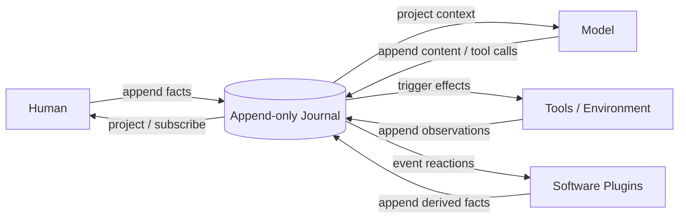

# Knot

**A Journal-first agent runtime and workbench.**

[中文](README.md) · [Core concepts](docs/concepts.md) · [Plugin practices](docs/plugin-best-practices.md)

Humans, models, tools, and software plugins tie facts into one append-only Journal. A plugin reacts to facts that already happened and either appends another fact or stays silent. Their assembly becomes the agent, instead of concentrating every concern in a growing AgentLoop.

> Knot is alpha software. CASE1, CASE2, and Web Run are executable today. The Assembly authoring API, Studio, Case/Eval, and export formats are still being validated and are not frozen public contracts.


## One model



```text
Journal → Projection → Reaction → Effect → Journal
```

- The **Journal** is the authoritative append-only sequence of business facts.
- A **Projection** derives model context, UI, todo state, or metrics without creating another source of truth.
- A **Reaction** subscribes to events and decides whether to append another fact.
- An **Effect** interacts with a model, tool, filesystem, user, or environment and records the completed observation.
- An **Assembly** selects plugins and registration order, producing one concrete agent.

The kernel has no privileged business AgentLoop. Loops may exist, but they emerge from assembled event reactions and stop naturally when no reaction appends another event.

## Why

Complex agent harnesses tend to accumulate prompting, context, tools, permissions, retries, state machines, and UI behavior inside one control loop. The features work, but every change requires understanding the whole system, and failures become difficult to attribute.

Knot organizes the problem differently:

1. Completed business facts enter the Journal.
2. Each plugin owns one explainable reaction or effect boundary.
3. Plugins do not call other plugin implementations; they collaborate through event protocols.
4. Assembly owns semantic relationships, registration order, and completeness.
5. Tests replace providers, tools, or output plugins through assembly.

Observability, testability, replaceability, and local reasoning follow from that model. They are not extra kernel subsystems.

## The entire kernel

[`src/journal.ts`](src/journal.ts) is currently 56 lines, imports nothing, and knows nothing about models, tools, prompts, sessions, storage, trace, or UI.

```ts
type Event = { readonly type: string; readonly data: unknown }
type Handler = (event: Event) => void | Promise<void>
type Plugin = (journal: Journal) => void

interface Journal {
  append(type: string, data: unknown): Event
  read(): readonly Event[]
  subscribe(type: string, handler: Handler): void
}
```

Its current guarantees are append-only facts, at-most-once invocation of each matching subscriber during a normal drain, breadth-first Journal order, serial registration order for subscribers of one event, legal zero-subscriber events, unchanged error propagation, and non-reentrant `runUntilIdle`. A thrown handler aborts that drain immediately; the kernel neither fills missed deliveries nor retries them.

CASE1 and CASE2 use the same kernel without business-specific privileges. See [Core concepts](docs/concepts.md) for the complete model.

## How an agent emerges

One typical tool trajectory is:

```text
user.message
  → context.dynamic
  → content.request
  → llm.request
  → llm.generated
  → tool.call
  → tool.result
  → llm.request
  → assistant.message
```

These arrows are not a built-in workflow. Each step comes from a plugin subscription and its produced facts. Rules, small models, or static sources may replace an LLM as a content source; the model is not the only content-producing role.

Plugins have no direct implementation dependencies, but business preconditions still exist. A `tool.call` needs an executor and an `llm.request` needs a provider. Protocols express relationships; Assembly is responsible for composing a set that works.

## Executable evidence

| Case | Scenario | Boundaries already exercised |
|---|---|---|
| **CASE1** | Isolated reproduction of a real terminal assistant | ordered content sources, per-turn dynamic context, function calling, parallel tool batches, external state and corrective hints, compression checkpoints, mock/real providers, JSONL restore, non-authoritative live output |
| **CASE2** | Usable coding agent | read/write/edit/bash, approval, ask, Todo/Goal guards, steering, graceful pause, compaction, persistence, independent Subagent Journals, Web Run, real DeepSeek/Qwen models |
| **CASE3** | Planned unified assistant entry | one entry Journal routing work to persistent project or domain Journals |

### CASE1 — terminal assistant

```text
user.message → shortcut/content source → bash tool → tool.result
             → LLM → bash(select) → tool.result → LLM → assistant.message
```

```bash
npm install
npm run case1
```

The default path uses a deterministic mock provider and Android-shaped mock tools, with no API key required.

### CASE2 — coding agent

```bash
export KNOT_BASE_URL="https://example.com/v1"
export KNOT_MODEL="model-name"
export KNOT_API_KEY="..." # when required by the service
npm run case2 -- "inspect this workspace and run its tests"
```

CASE2 can inspect, modify, and verify files in a real workspace. Its CLI uses an OpenAI-compatible provider; the mock provider is used by tests and reproducible Case assemblies. Real Workbench providers are configured through the Host environment.

## Workbench

```bash
npm run workbench
```

Open `http://127.0.0.1:4317/`.

### Run

- create, select, and restore Sessions;
- stream content, reasoning, tool calls, and tool output;
- handle approval, ask, Todo, Goal, and Subagent interactions;
- inspect Journal, Trace, context projections, and plugin information;
- select Host-configured model, reasoning effort, and approval policy.

### Studio

Studio targets this loop:

```text
Compose → Run → Inspect → Evaluate → Export
```

The first real CASE2 vertical slice is implemented: inspect Assembly, prompt, tools, and plugin order; run Mock or real Cases; persist fingerprinted Generations and run evidence. Plugin editing, Dataset Eval, comparison, and export remain under development.

## Model configuration

Workbench currently uses Host-side Provider Profiles. Credentials are never returned to the browser or written to the Journal.

Official DeepSeek example:

```bash
export DEEPSEEK_API_KEY="..."
export KNOT_DEEPSEEK_MODEL="deepseek-flash"       # optional
export KNOT_DEEPSEEK_THINKING="enabled"           # optional
export KNOT_DEEPSEEK_REASONING_EFFORT="high"      # optional
npm run workbench
```

Generic OpenAI-compatible CASE1/CLI example:

```bash
export KNOT_BASE_URL="https://example.com/v1"
export KNOT_API_KEY="..."
export KNOT_MODEL="model-name"
npm run case1
```

User-configurable arbitrary Provider/Profile management in Web is not implemented yet.

## Concept relationships

```text
Project
├── Assembly / Agent definition
│   ├── plugins, tools, prompt, policies
│   └── immutable Generations
├── Cases
│   ├── input, fixture, assertions, eval settings
│   └── Runs
└── Sessions
    ├── pinned Assembly generation
    ├── Journal
    └── parent / child relationship
```

- **Project:** the durable development, validation, and export boundary.
- **Assembly:** an executable agent definition.
- **Generation:** an immutable Assembly version.
- **Case:** a reproducible test or experiment, not the agent itself.
- **Session:** one Assembly execution and its Journal.
- **Run:** the Session and evaluation evidence produced by executing a Case.

These terms are still being validated by CASE1–CASE3. See [Core concepts](docs/concepts.md).

## Plugins and ecosystem

A plugin is still the smallest possible TypeScript function:

```ts
type Plugin = (journal: Journal) => void
```

Installation is one function call. A plugin may keep private mechanical state in a closure, while business facts belong in the Journal and external state belongs to its real external owner.

Knot has no marketplace and has not frozen `definePlugin` / `defineAssembly` as public APIs. The next step is to derive display metadata from the actual Assembly definition so execution, registration order, and Studio have one source rather than parallel manifests.

The expected minimum shareable unit is:

```text
implementation + metadata + focused test or Case
```

not merely code that can be loaded without evidence that its composition is correct. See [Plugin practices](docs/plugin-best-practices.md).

## Proven and still under test

Executable Cases currently demonstrate that:

- one 56-line Journal kernel supports two materially different agents;
- trace, JSONL, context, tools, LLMs, and guards need no kernel privilege;
- mock and real providers can preserve the same business boundaries;
- Web and Host connect through ports without entering the Journal kernel;
- adding one domain plugin need not create direct dependencies in other plugins.

Still to be measured publicly:

- code size and maintenance cost at comparable feature scope;
- event dispatch throughput, latency, and memory;
- context duplication, cache hit rate, and useful information density;
- task success and path efficiency across model/Assembly combinations;
- long-term compatibility of Assembly, Plugin, Case, and export formats.

Knot does not claim to invent event queues, event sourcing, or plugins. It asks whether applying those principles rigorously to an agent harness can produce a small, explainable, executable system that moves from experiments to delivery.

## Test

```bash
npm test
```

Tests replace real providers, tools, and output boundaries through assembly rather than maintaining a separate test runtime.

## Contributing

The most useful contributions currently bring evidence rather than abstraction:

- a real Agent Case;
- a Provider adapter;
- a plugin with a focused test;
- a reproducible context or tool failure;
- a model/harness comparison experiment;
- a real Workbench Run/Studio product slice.

Read [`AGENTS.md`](AGENTS.md) first. Start from an end-to-end trajectory, clear responsibilities, and an observed boundary. Do not pay for a boundary that does not exist yet.

## Documentation

- [Core concepts and relationships](docs/concepts.md)
- [Plugin design and practices](docs/plugin-best-practices.md)
- [Accepted CASE1 boundaries](docs/design/case1-active-boundaries.md)
- [CASE2 coding agent design](docs/design/case2-coding-agent-spec.md)
- [Minimal-kernel review response](docs/reviews/minimal-kernel-review-response.md)
