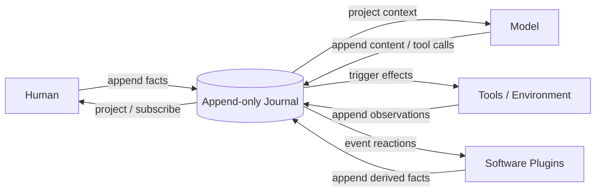
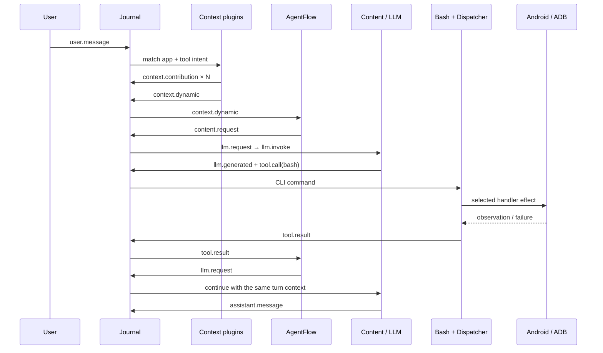
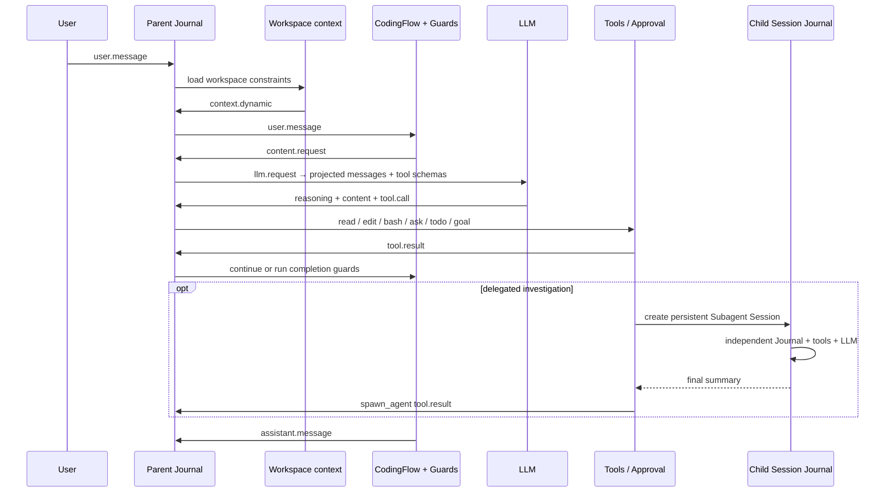

# Knot

**一个 Journal-first 的智能体运行时与实验平台。**

[English](README.en.md) · [核心概念](docs/concepts.md) · [插件最佳实践](docs/plugin-best-practices.md)

人类、模型、工具和软件插件围绕同一个追加式 Journal 共同“结绳记事”。插件响应已经发生的事实，选择追加新事实或保持沉默；它们经过装配后形成智能体，而不是把所有业务塞进一个不断膨胀的 AgentLoop。

> Knot 正处于 Alpha 阶段。CASE1、CASE2 和 Web Run 已可运行；Assembly 开发接口、Studio、Case/Eval 与导出格式仍在验证，尚未冻结为公共 API。


## 一个核心模型



```text
Journal → Projection → Reaction → Effect → Journal
```

- **Journal** 是权威的追加式业务事实序列。
- **Projection** 从事实生成模型上下文、UI、Todo 或统计视图，不制造第二份真相。
- **Reaction** 订阅事件，决定是否追加新事实。
- **Effect** 与模型、工具、文件系统、用户或外部环境交互，并记录完成后的观测。
- **Assembly** 决定安装哪些插件以及注册顺序，由此形成一个具体智能体。

Knot 内核没有一个拥有全部业务知识的中央 AgentLoop。循环可以存在，但它由装配后的事件反应自然形成；没有新事件时就自然停止。

## 为什么这样做

复杂 AgentHarness 很容易把提示词、上下文、工具、权限、重试、状态机和 UI 逐渐堆进同一个循环。最后每个功能都能工作，但一次修改需要理解整套系统，也很难判断错误属于模型、上下文、工具还是编排。

Knot 尝试把问题换一种组织方式：

1. 所有已经完成的业务事实进入 Journal。
2. 每个插件只负责一项可以清楚描述的反应或副作用。
3. 插件不直接调用其他插件；它们通过事件协议协作。
4. 语义关系、注册顺序和完整性由 Assembly 负责。
5. 测试只需替换装配中的 Provider、工具或输出插件。

由此得到可观察、可测试、可替换和可维护的行为边界。这些是核心模型的结果，而不是内核中额外实现的功能。

## 整个内核

[`src/journal.ts`](src/journal.ts) 目前只有 56 行，不导入任何模块，也不知道模型、工具、Prompt、Session、存储、Trace 或 UI 的存在。

```ts
type Event = { readonly type: string; readonly data: unknown }
type Handler = (event: Event) => void | Promise<void>
type Plugin = (journal: Journal) => void

interface Journal {
  append(type: string, data: unknown): Event
  read(): readonly Event[]
  subscribe(type: string, handler: Handler): void
}
```

内核当前只保证：append-only、正常 drain 中每个匹配订阅者至多调用一次、按 Journal 顺序广度优先投递、同一事件的订阅者按注册顺序串行执行、零订阅者合法、异常原样传播，以及 `runUntilIdle` 不可重入。Handler 抛错会立即中止本次 drain，内核不补投、不重试。

CASE1 和 CASE2 使用同一个内核，没有为各自业务增加内核特权。完整语义见[核心概念](docs/concepts.md)。

## Agent 如何形成

下面是一条典型工具调用轨迹：

```text
user.message
  → context.dynamic
  → content.request
  → llm.request
  → llm.generated
  → tool.call
  → tool.result
  → llm.request
  → assistant.message
```

这些箭头不是 Journal 内核内置的流程。每一步都来自某个插件的订阅和产出。规则、小模型或静态内容也可以替代 LLM 成为内容来源；模型并不是系统中唯一能生成内容的角色。

插件之间没有直接实现依赖，但并不意味着业务没有语义条件：例如 `tool.call` 需要执行者，`llm.request` 需要 Provider。协议表达关系，Assembly 负责把一组能够共同工作的插件装配起来。

## 已验证的案例

CASE1 和 CASE2 不是为了展示更多功能，而是从两个相反方向检验同一个内核：CASE1
面对高频、短上下文和受限动作空间；CASE2 面对长程任务、开放环境和大量工具交互。
二者使用同一个 56 行 Journal，没有为各自业务增加内核特权。

| Case | 真实场景 | 验证重点 | 结果 |
|---|---|---|---|
| **CASE1** | USB 真机上的终端控制助手 | 动态工具上下文、单一 Bash 入口、业务 CLI、候选状态、Mock/ADB Dispatcher | 66 个连续请求覆盖 56 个 CLI 命令；65/66 命中预期路由；无未捕获异常 |
| **CASE2** | DeepSeek 驱动的 Coding Agent | 开放工作区、审批与交互、Todo/Goal Guard、长程工具链、独立 Subagent Journal | 完成 5G 离散事件仿真器的多阶段扩展；最终 67 个测试通过 |
| **CASE3** | 规划中的统一助手入口 | 一个入口 Journal 路由到持久的项目/领域 Journal | 尚未实现，不计入已验证结论 |

> 下列数据来自真实保存的 Journal 和当时的代码快照。它们是工程实验记录，不是跨项目的
> 标准化 Benchmark；模型、语言、功能边界和统计口径都会影响结果。

### CASE1：真实终端控制助手

CASE1 参考同类 Android 终端助手的关键行为进行复刻，但没有把 Android 实现搬进一个新的
AgentLoop：稳定系统提示词和 Bash Function Schema 保持固定；当前用户请求只匹配相关
应用与 CLI 详细用法；统一 Catalog、Parser 和 Dispatcher 把调用交给 Mock 或 ADB
Handler；候选列表等未完成状态留在工具域内，下一轮继续通过动态上下文提供给模型。

主要插件及其唯一职责：

| 插件 | 订阅 → 产出 | 职责 |
|---|---|---|
| `AppMatch` / `ToolIntentMatch` | `user.message` → `context.contribution` | 只匹配本轮相关应用和工具说明 |
| `RuntimeContext` | `user.message` → `context.dynamic` | 汇总本轮贡献与仍有效的设备状态 |
| `AgentFlow` | `context.dynamic` / `tool.result` → `content.request` / `llm.request` | 推进一次内容生成，不执行模型或工具 |
| `ContentSources` | `content.request` → content / `llm.request` | 让 Shortcut、规则或 LLM 按装配顺序竞争同一种结果 |
| `ContextAssembler` / `LLMProvider` | `llm.request` → `llm.invoke` → generated facts | 投影模型输入并产生一次完整决策 |
| `Tools` | `tool.call` → `tool.result` | 执行唯一的 Bash Function；CLI 内部再经 Parser、Dispatcher 到具体 Handler |
| `CompressHistory` / `Output` | generation / reply → checkpoint / presentation | 历史检查点与最终输出，各自不进入业务编排 |



2026-09-25 的单 Session 真机冒烟连续执行 66 个用户请求，并在相邻请求间故意等待 5 秒观察手机端效果，具体模型响应时长和模型API相关。

| 指标 | 结果 |
|---|---:|
| 用户请求 / 覆盖的不同 CLI 命令 | 66 / 56 |
| 命中预期工具路径 | 65 / 66（1 次失败后的语义恢复选择了重试） |
| 未捕获运行时异常 | 0 |
| Journal 事件 / JSONL 大小 | 880 / 约 282 KB |
| 模型生成次数 | 133（平均每个用户请求 2.02 次） |
| 单次模型输入 tokens | 平均 6,055；中位数 6,508；最大 10,638 |
| 单次模型输出 tokens | 平均 27.8；中位数 25 |
| 单请求执行耗时（不含故意等待） | 平均 2.47 s；P95 5.09 s；最大 11.69 s |

这轮实验同时保留了失败事实：联系人号码格式、附近搜索和部分 ADB 能力出现过业务错误，
但错误都作为 `tool.result` 返回，模型可以解释、重试或降级，Journal drain 没有被工具异常
击穿。最后一次请求的完整模型输入仍为 10,638 tokens；对于 32K 配置窗口，66 轮之后
尚未触发压缩，以200k有效上下文估算，单个session可连续处理1300个以上的用户请求，
且可以在动态上下文拼接的情况下，参照历史经验做到72%以上的缓存命中率。
重点验证“按意图提供详细工具上下文 + 极短工具结果”可以持续保持较高信息密度。

#### CASE1 代码量快照

与同类智能体产品中承担相近职责的模块相比：

| 对比边界 | Knot CASE1 | Android 基线 | Knot 占比 | 体量差异 |
|---|---:|---:|---:|---:|
| Agent 栈（不含 UI） | 5,636 | 29,544 | 19.1% | 约 5.2× 更小 |
| 工具执行层（ADB + Catalog） | 2,962 | 17,590 | 16.8% | 约 5.9× 更小 |
| 运行时（Journal + 插件） | 2,393 | 约 10,653 | 约 22% | 约 4.5× 更小 |
| 测试代码 | 2,012 | 21,939 | 9.2% | 约 10.9× 更小 |

该快照的意义是：当 Catalog、上下文匹配、CLI 解析、Dispatcher 与 Handler
各自只有一个事实来源时，复刻相同核心行为所需的业务代码显著减少。

```bash
npm install
npm run case1
```

默认命令使用确定性 Mock Provider 和 Android 形状的 Mock 工具，不需要 API Key。连接
ADB 真机并配置 Provider 后，可运行 `npm run smoke:case1-adb` 重放完整连续冒烟。

### CASE2：Coding Agent

CASE2 不再定义一个“编码状态机”。`CodingFlow` 只负责从用户消息和工具结果继续生成，
并在准备提交最终回复时调用 Steering、Todo 和 Goal Guard。文件操作、审批、Ask、Todo、
Goal 和 Subagent 都是普通工具；Subagent 是具有独立 Journal、模型配置和工作目录的持久
Session，父 Agent 只接收它最终返回的摘要。

| 插件 | 订阅 → 产出 | 职责 |
|---|---|---|
| `WorkspaceContext` | `user.message` → `context.dynamic` | 提供工作目录及 `AGENTS.md` / `CLAUDE.md` 项目约束 |
| `CodingFlow` | user / tool / generation events → next request or reply | 推进任务，并在提交最终回复前执行 Guard |
| `ContextAssembler` / `LLMProvider` | `llm.request` → `llm.invoke` → generated facts | 从 Journal 投影上下文并调用模型 |
| `Tools` | `tool.call` → `tool.result` | 运行 read/write/edit/bash/ask/todo/goal/spawn_agent，并在外层执行审批策略 |
| `CompressHistory` | `llm.generated` → checkpoint events | 只在达到窗口阈值时生成语义检查点 |
| `JSONL` / `Output` / `ControlledBoundary` | facts → storage / UI / pause | 平台能力仍以普通插件或 Host 端口装配 |



2026-09-20 的真实验证使用 `deepseek-flash` 在一个工作目录中理解并持续扩展 5G 离散
事件仿真器：先分析现有 DES，再增加 UE 话务模型与网元容量规格，最后加入入口流控和周期
重试；其中一个网络仿真架构调查被委托给独立 Subagent。最终测试从 40 个增长到 67 个并
全部通过。

| 指标 | Parent Session | Subagent Session |
|---|---:|---:|
| 用户 / Steering 输入 | 4 | 1 个委托 |
| Journal 事件 | 783 | 47 |
| JSONL 大小 | 约 1.03 MB | 约 236 KB |
| 模型生成次数 | 140 | 7 |
| 独立工具调用 | 145 | 15 |
| 主要工具分布 | edit 84 / bash 28 / read 21 | read 13 / bash 2 |
| 最后一次模型输入 | 151,364 tokens | 30,673 tokens |
| 单次模型输入平均值 | 97,821 tokens | 18,819 tokens |
| 单次模型输出中位数 | 315 tokens | 133 tokens |

Parent 的累计输出 usage 为 94,073 tokens，其中包含 DeepSeek 的长 reasoning；它不是用户
最终看到的文本量。这组数据一方面证明了开放式长程任务、并行工具与持久 Subagent 可以在
同一事件模型上工作，另一方面也暴露出 CASE2 当前真正需要优化的是模型可见上下文、工具
结果预算和推理成本，而不是继续扩充 Journal 内核。

#### CASE2 与 Pi 的代码量快照

以下口径来自本地仓库快照；Pi 的 loop、harness、session 与产品层是不同边界，因此同时
列出而不把其中任意一个数字包装成唯一结论。

| 对比边界 | Knot | Pi 基线 | 观察 |
|---|---:|---:|---|
| Agent 大脑：编排 + 工具 + 持久化 | 约 2,572 | loop 约 1,861；harness 约 10,800；harness + session 约 30K | Knot 比单独 loop 多约 40%，但比完整 harness 边界少约 76%–91% |
| Agent 大脑 + LLM 客户端 | 约 2,572（已含 OpenAI / DeepSeek） | 约 1,861 + 24,384 | Knot 当前 Provider 适配很薄，覆盖面也更窄 |
| 可运行 Coding 产品（不含 LLM 包） | 约 7,372 | 约 95K | 当前快照约 12.9× 更小 |
| Web / 终端 UI 增量 | 约 1,859 | 约 18K TUI | 当前快照约 9.7× 更小，产品能力并非完全等价 |
| 测试 | 约 8.7K | Pi agent 测试 12K+ | 两边测试范围不同，仅反映维护体量 |

代码少本身不是目标，也不能证明效果更好。这里更重要的信号是：CASE2 已包含真实工具、
持久化、Flow、Guard、审批、Web Run 和 Subagent，但每项职责仍能落在独立、可描述和可替换
的边界内；代码量下降是职责熵下降后的结果。

```bash
export KNOT_BASE_URL="https://example.com/v1"
export KNOT_MODEL="model-name"
export KNOT_API_KEY="..." # 如果服务需要
npm run case2 -- "检查当前工程并运行测试"
```

CASE2 可以在真实工作目录中读取、修改和验证文件。CLI 使用 OpenAI-compatible Provider；
Mock Provider 用于测试和可复现 Case 装配。Workbench 的真实 Provider 由 Host 环境配置。

## Workbench

```bash
npm run workbench
```

浏览器打开 `http://127.0.0.1:4317/`。

### Run

- 创建、选择和恢复 Session；
- 流式展示 content、reasoning、工具调用与工具输出；
- 处理审批、ask、Todo、Goal 和 Subagent；
- 检查真实 Journal 与 Trace；Context 和插件读模型仍在逐步接入真实 Assembly；
- 选择 Host 已配置的模型、推理强度和审批策略。

### Studio

Studio 的目标流程是：

```text
Compose → Run → Inspect → Evaluate → Export
```

当前已完成 CASE2 的第一个真实纵向闭环：展示 Assembly、Prompt、工具和插件顺序，执行 Mock/真实 Case，保存声明指纹、Generation 身份和运行证据。当前 Generation 还没有封存可执行代码制品；插件编辑、Dataset Eval、对比和导出仍在建设。

## 模型配置

Workbench 当前支持 Host 侧 Provider Profile。凭据不会返回浏览器，也不会写入 Journal。

可在 **Project settings → Add local Provider profile** 中添加 OpenAI-compatible 或 DeepSeek 配置。配置保存在本机 `.knot/providers.json`，文件权限为 `0600`；API Key 只会在创建时从浏览器发送到本地 Host，后续接口只返回脱敏摘要。环境变量 Profile 继续受支持。

官方 DeepSeek 示例：

```bash
export DEEPSEEK_API_KEY="..."
export KNOT_DEEPSEEK_MODEL="deepseek-flash"       # 可选
export KNOT_DEEPSEEK_THINKING="enabled"           # 可选
export KNOT_DEEPSEEK_REASONING_EFFORT="high"      # 可选
npm run workbench
```

通用 OpenAI-compatible CASE1/CLI 示例：

```bash
export KNOT_BASE_URL="https://example.com/v1"
export KNOT_API_KEY="..."
export KNOT_MODEL="model-name"
npm run case1
```

当前 Web 支持新增和选择本地 Profile；编辑、删除和系统密钥链集成尚未实现。

## 概念关系

```text
Project
├── Assembly / Agent definition
│   ├── plugins, tools, prompt, policies
│   └── immutable Generations
├── Cases
│   ├── input, fixture, assertions, eval settings
│   └── Runs
└── Sessions
    ├── pinned Assembly generation
    ├── Journal
    └── parent / child relationship
```

- **Project**：长期开发、验证和导出的工程边界。
- **Assembly**：一个智能体的可执行定义。
- **Generation**：Assembly 的不可变版本。
- **Case**：可复现的测试或实验场景，不是智能体本身。
- **Session**：Assembly 的一次运行实例及其 Journal。
- **Run**：执行某个 Case 后产生的 Session 和评估证据。

这些词汇正在由 CASE1–CASE3 验证；详见[核心概念](docs/concepts.md)。

## 插件与生态

当前插件仍然是最小的 TypeScript 函数：

```ts
type Plugin = (journal: Journal) => void
```

安装插件就是调用一次函数。插件可以用闭包保存私有机械状态，但业务事实应进入 Journal，外部状态应由真实所有者持有。

Knot 暂时没有插件 Marketplace，也没有冻结 `definePlugin` / `defineAssembly` 公共 API。CASE2 当前使用内部 `PluginNode = { plugin, metadata }` 让实际安装顺序和 Studio 展示来自同一组定义；这只是解决单一来源的内部形状，还不是承诺给生态的公共 API。

未来一个可分享插件的最小单位预计是：

```text
实现 + 元数据 + 聚焦测试或 Case
```

而不是一段只能成功加载、无法证明编排正确的代码。详见[插件最佳实践](docs/plugin-best-practices.md)。

## 已证明与仍待验证

已经由可执行 Case 证明：

- 56 行 Journal 内核可以支撑两个明显不同的 Agent；
- Trace、JSONL、上下文、工具、LLM 和 Guard 不需要内核特权；
- Mock 和真实 Provider 可以保持相同业务边界；
- Web/Host 可以通过端口接线，而不进入 Journal 内核；
- 新增一个领域插件不要求其他插件直接依赖它。

仍需通过公开实验验证：

- 当前代码量快照能否在功能继续增长后保持，以及是否真正降低长期维护成本；
- 事件分发的吞吐、延迟和内存；
- 上下文重复率、缓存命中率和有效信息密度；
- 不同模型与 Assembly 组合的任务成功率和路径效率；
- Assembly、Plugin、Case 与导出格式的长期兼容性。

Knot 不声称发明了事件队列、Event Sourcing 或插件系统。它探索的是：把这些原则严格用于 AgentHarness，能否形成一个极小、可解释、可运行并能从实验走向交付的系统。

## 测试

```bash
npm test
```

测试使用不同装配替换真实 Provider、工具和输出边界，而不是建立一套独立测试运行时。

## 参与方式

当前最有价值的贡献不是增加抽象层，而是带来可以验证边界的证据：

- 一个真实 Agent Case；
- 一个 Provider Adapter；
- 一个带聚焦测试的插件；
- 一个可复现的上下文或工具问题；
- 一组模型/Harness 对比实验；
- Workbench Run/Studio 的真实产品闭环。

贡献前请阅读 [`AGENTS.md`](AGENTS.md)。基本原则是：先给出端到端轨迹、职责和已经遇到的边界，再决定是否增加机制；不要为不存在的边界提前付费。

## 文档

- [核心概念与关系](docs/concepts.md)
- [插件设计与最佳实践](docs/plugin-best-practices.md)
- [CASE1 已确认边界](docs/design/case1-active-boundaries.md)
- [CASE2 Coding Agent 设计](docs/design/case2-coding-agent-spec.md)
- [最小内核评审回应](docs/reviews/minimal-kernel-review-response.md)
