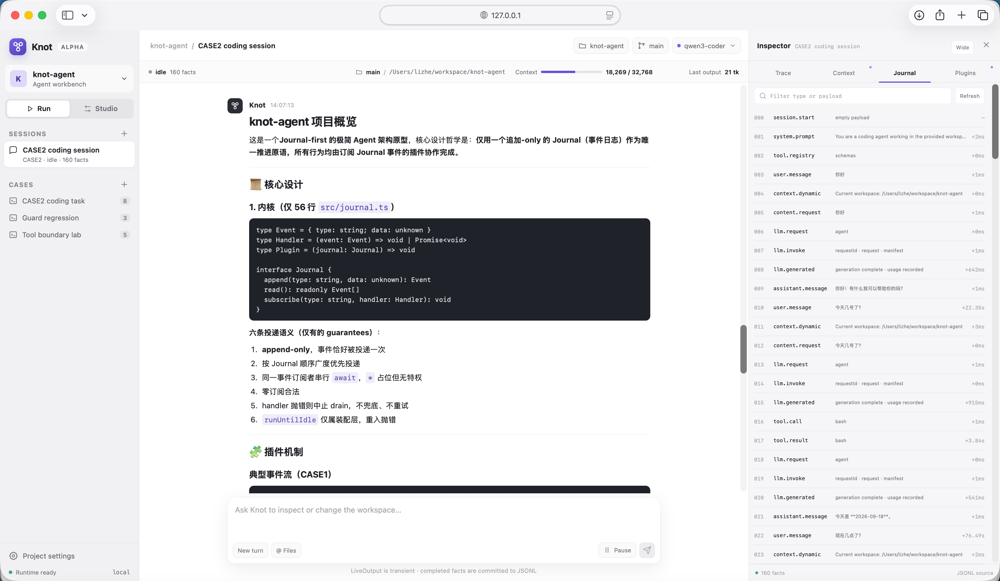
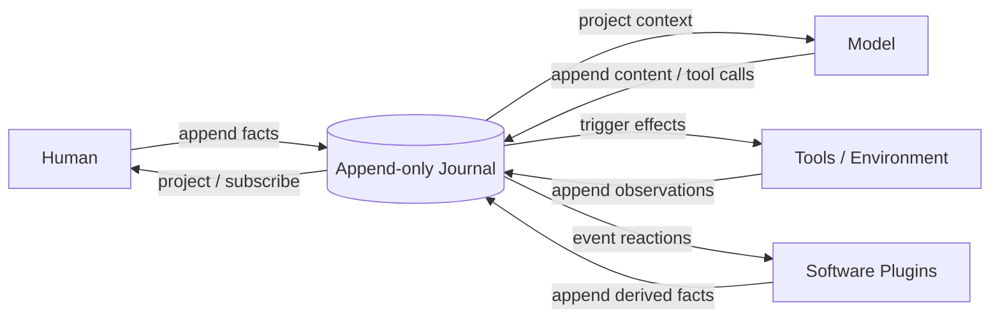

# Knot

**一个 Journal-first 的智能体运行时与实验平台。**

[English](README.en.md) · [核心概念](docs/concepts.md) · [插件最佳实践](docs/plugin-best-practices.md)

人类、模型、工具和软件插件围绕同一个追加式 Journal 共同“结绳记事”。插件响应已经发生的事实，选择追加新事实或保持沉默；它们经过装配后形成智能体，而不是把所有业务塞进一个不断膨胀的 AgentLoop。

> Knot 正处于 Alpha 阶段。CASE1、CASE2 和 Web Run 已可运行；Assembly 开发接口、Studio、Case/Eval 与导出格式仍在验证，尚未冻结为公共 API。



## 一个核心模型



```text
Journal → Projection → Reaction → Effect → Journal
```

- **Journal** 是权威的追加式业务事实序列。
- **Projection** 从事实生成模型上下文、UI、Todo 或统计视图，不制造第二份真相。
- **Reaction** 订阅事件，决定是否追加新事实。
- **Effect** 与模型、工具、文件系统、用户或外部环境交互，并记录完成后的观测。
- **Assembly** 决定安装哪些插件以及注册顺序，由此形成一个具体智能体。

Knot 内核没有一个拥有全部业务知识的中央 AgentLoop。循环可以存在，但它由装配后的事件反应自然形成；没有新事件时就自然停止。

## 为什么这样做

复杂 AgentHarness 很容易把提示词、上下文、工具、权限、重试、状态机和 UI 逐渐堆进同一个循环。最后每个功能都能工作，但一次修改需要理解整套系统，也很难判断错误属于模型、上下文、工具还是编排。

Knot 尝试把问题换一种组织方式：

1. 所有已经完成的业务事实进入 Journal。
2. 每个插件只负责一项可以清楚描述的反应或副作用。
3. 插件不直接调用其他插件；它们通过事件协议协作。
4. 语义关系、注册顺序和完整性由 Assembly 负责。
5. 测试只需替换装配中的 Provider、工具或输出插件。

由此得到可观察、可测试、可替换和可维护的行为边界。这些是核心模型的结果，而不是内核中额外实现的功能。

## 整个内核

[`src/journal.ts`](src/journal.ts) 目前只有 56 行，不导入任何模块，也不知道模型、工具、Prompt、Session、存储、Trace 或 UI 的存在。

```ts
type Event = { readonly type: string; readonly data: unknown }
type Handler = (event: Event) => void | Promise<void>
type Plugin = (journal: Journal) => void

interface Journal {
  append(type: string, data: unknown): Event
  read(): readonly Event[]
  subscribe(type: string, handler: Handler): void
}
```

内核当前只保证：append-only、正常 drain 中每个匹配订阅者至多调用一次、按 Journal 顺序广度优先投递、同一事件的订阅者按注册顺序串行执行、零订阅者合法、异常原样传播，以及 `runUntilIdle` 不可重入。Handler 抛错会立即中止本次 drain，内核不补投、不重试。

CASE1 和 CASE2 使用同一个内核，没有为各自业务增加内核特权。完整语义见[核心概念](docs/concepts.md)。

## Agent 如何形成

下面是一条典型工具调用轨迹：

```text
user.message
  → context.dynamic
  → content.request
  → llm.request
  → llm.generated
  → tool.call
  → tool.result
  → llm.request
  → assistant.message
```

这些箭头不是 Journal 内核内置的流程。每一步都来自某个插件的订阅和产出。规则、小模型或静态内容也可以替代 LLM 成为内容来源；模型并不是系统中唯一能生成内容的角色。

插件之间没有直接实现依赖，但并不意味着业务没有语义条件：例如 `tool.call` 需要执行者，`llm.request` 需要 Provider。协议表达关系，Assembly 负责把一组能够共同工作的插件装配起来。

## 已验证的案例

| Case | 场景 | 已验证的边界 |
|---|---|---|
| **CASE1** | 真实终端助手的隔离复刻 | 有序内容源、每轮动态上下文、Function Calling、批量并行工具、外部状态与纠错 Hint、压缩检查点、Mock/真实 Provider、JSONL 恢复、非权威流式输出 |
| **CASE2** | 可实际使用的 Coding Agent | read/write/edit/bash、权限审批、ask、Todo/Goal Guard、steering、优雅暂停、压缩、持久化、Subagent 独立 Journal、Web Run、真实 DeepSeek/Qwen 模型 |
| **CASE3** | 规划中的统一助手入口 | 一个入口 Journal 路由到持久的项目/领域 Journal，并把结果交付回用户 |

### CASE1：终端助手

```text
user.message → shortcut/content source → bash tool → tool.result
             → LLM → bash(select) → tool.result → LLM → assistant.message
```

```bash
npm install
npm run case1
```

默认使用确定性 Mock Provider 和 Android 形状的 Mock 工具，不需要 API Key。

### CASE2：Coding Agent

```bash
export KNOT_BASE_URL="https://example.com/v1"
export KNOT_MODEL="model-name"
export KNOT_API_KEY="..." # 如果服务需要
npm run case2 -- "检查当前工程并运行测试"
```

CASE2 可以在真实工作目录中读取、修改和验证文件。CLI 使用 OpenAI-compatible Provider；Mock Provider 用于测试和可复现 Case 装配。Workbench 的真实 Provider 由 Host 环境配置。

## Workbench

```bash
npm run workbench
```

浏览器打开 `http://127.0.0.1:4317/`。

### Run

- 创建、选择和恢复 Session；
- 流式展示 content、reasoning、工具调用与工具输出；
- 处理审批、ask、Todo、Goal 和 Subagent；
- 检查真实 Journal 与 Trace；Context 和插件读模型仍在逐步接入真实 Assembly；
- 选择 Host 已配置的模型、推理强度和审批策略。

### Studio

Studio 的目标流程是：

```text
Compose → Run → Inspect → Evaluate → Export
```

当前已完成 CASE2 的第一个真实纵向闭环：展示 Assembly、Prompt、工具和插件顺序，执行 Mock/真实 Case，保存声明指纹、Generation 身份和运行证据。当前 Generation 还没有封存可执行代码制品；插件编辑、Dataset Eval、对比和导出仍在建设。

## 模型配置

Workbench 当前支持 Host 侧 Provider Profile。凭据不会返回浏览器，也不会写入 Journal。

可在 **Project settings → Add local Provider profile** 中添加 OpenAI-compatible 或 DeepSeek 配置。配置保存在本机 `.knot/providers.json`，文件权限为 `0600`；API Key 只会在创建时从浏览器发送到本地 Host，后续接口只返回脱敏摘要。环境变量 Profile 继续受支持。

官方 DeepSeek 示例：

```bash
export DEEPSEEK_API_KEY="..."
export KNOT_DEEPSEEK_MODEL="deepseek-flash"       # 可选
export KNOT_DEEPSEEK_THINKING="enabled"           # 可选
export KNOT_DEEPSEEK_REASONING_EFFORT="high"      # 可选
npm run workbench
```

通用 OpenAI-compatible CASE1/CLI 示例：

```bash
export KNOT_BASE_URL="https://example.com/v1"
export KNOT_API_KEY="..."
export KNOT_MODEL="model-name"
npm run case1
```

当前 Web 支持新增和选择本地 Profile；编辑、删除和系统密钥链集成尚未实现。

## 概念关系

```text
Project
├── Assembly / Agent definition
│   ├── plugins, tools, prompt, policies
│   └── immutable Generations
├── Cases
│   ├── input, fixture, assertions, eval settings
│   └── Runs
└── Sessions
    ├── pinned Assembly generation
    ├── Journal
    └── parent / child relationship
```

- **Project**：长期开发、验证和导出的工程边界。
- **Assembly**：一个智能体的可执行定义。
- **Generation**：Assembly 的不可变版本。
- **Case**：可复现的测试或实验场景，不是智能体本身。
- **Session**：Assembly 的一次运行实例及其 Journal。
- **Run**：执行某个 Case 后产生的 Session 和评估证据。

这些词汇正在由 CASE1–CASE3 验证；详见[核心概念](docs/concepts.md)。

## 插件与生态

当前插件仍然是最小的 TypeScript 函数：

```ts
type Plugin = (journal: Journal) => void
```

安装插件就是调用一次函数。插件可以用闭包保存私有机械状态，但业务事实应进入 Journal，外部状态应由真实所有者持有。

Knot 暂时没有插件 Marketplace，也没有冻结 `definePlugin` / `defineAssembly` 公共 API。下一步将从实际 Assembly 定义派生可展示元数据，保证执行代码、注册顺序和 Studio 展示只有一个来源，而不是维护平行 Manifest。

未来一个可分享插件的最小单位预计是：

```text
实现 + 元数据 + 聚焦测试或 Case
```

而不是一段只能成功加载、无法证明编排正确的代码。详见[插件最佳实践](docs/plugin-best-practices.md)。

## 已证明与仍待验证

已经由可执行 Case 证明：

- 56 行 Journal 内核可以支撑两个明显不同的 Agent；
- Trace、JSONL、上下文、工具、LLM 和 Guard 不需要内核特权；
- Mock 和真实 Provider 可以保持相同业务边界；
- Web/Host 可以通过端口接线，而不进入 Journal 内核；
- 新增一个领域插件不要求其他插件直接依赖它。

仍需通过公开实验验证：

- 与其他 Harness 在同等功能边界下的代码量和维护成本；
- 事件分发的吞吐、延迟和内存；
- 上下文重复率、缓存命中率和有效信息密度；
- 不同模型与 Assembly 组合的任务成功率和路径效率；
- Assembly、Plugin、Case 与导出格式的长期兼容性。

Knot 不声称发明了事件队列、Event Sourcing 或插件系统。它探索的是：把这些原则严格用于 AgentHarness，能否形成一个极小、可解释、可运行并能从实验走向交付的系统。

## 测试

```bash
npm test
```

测试使用不同装配替换真实 Provider、工具和输出边界，而不是建立一套独立测试运行时。

## 参与方式

当前最有价值的贡献不是增加抽象层，而是带来可以验证边界的证据：

- 一个真实 Agent Case；
- 一个 Provider Adapter；
- 一个带聚焦测试的插件；
- 一个可复现的上下文或工具问题；
- 一组模型/Harness 对比实验；
- Workbench Run/Studio 的真实产品闭环。

贡献前请阅读 [`AGENTS.md`](AGENTS.md)。基本原则是：先给出端到端轨迹、职责和已经遇到的边界，再决定是否增加机制；不要为不存在的边界提前付费。

## 文档

- [核心概念与关系](docs/concepts.md)
- [插件设计与最佳实践](docs/plugin-best-practices.md)
- [CASE1 已确认边界](docs/design/case1-active-boundaries.md)
- [CASE2 Coding Agent 设计](docs/design/case2-coding-agent-spec.md)
- [最小内核评审回应](docs/reviews/minimal-kernel-review-response.md)
