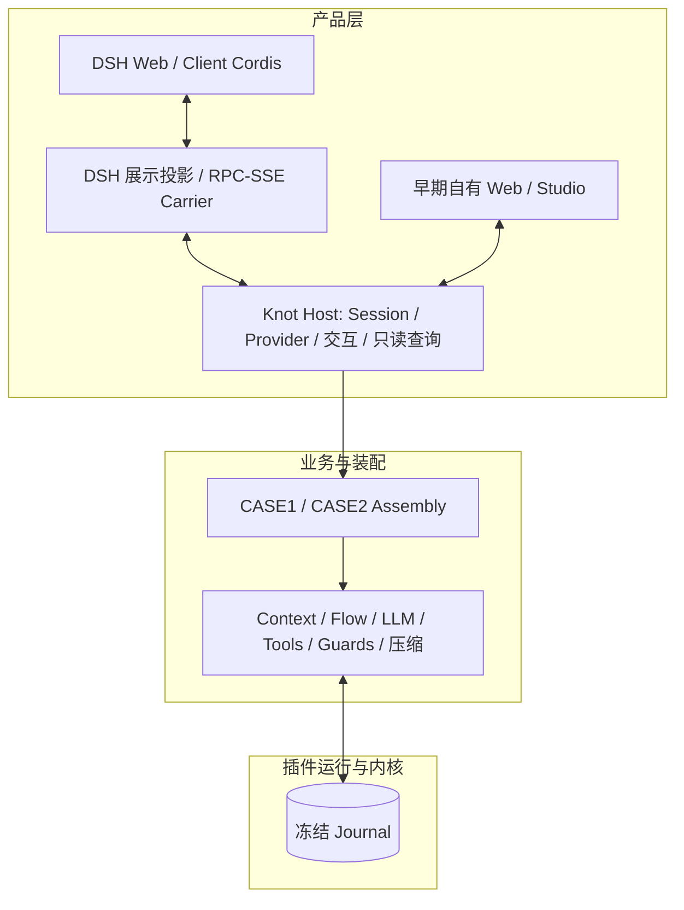

# Knot Workbench 产品模型与当前边界

状态：现状校准稿，供评审；不是外部公共协议

代码基线：`91f2200`（2026-10-04），DSH `0.2.0-rc.1`

原则：单一来源、职责清晰、不修改 Journal 内核迁就产品、不为未遇到的边界付费

## 1. 当前定位

Workbench 让人使用、观察和验证由 Journal 插件装配出的 Agent。当前主线是一个真实可用的
Coding Agent Run，并保留 CASE1 的终端助手验证路径；不是通用可视化编程平台或插件市场。

MATLAB/Simulink 曾用于帮助区分“元件、模型、工程、测试、运行记录”。这个类比仍可解释
概念，但不能作为照搬画布、拖拽连线、IDE 或完整实验室的开发任务清单。

```text
修改源码 / 装配 → 编译测试 → 运行 Session → 检视 Journal → 按真实问题修订
```

目前插件和 Assembly 仍由人或 Coding Agent 编辑源码。Web 不提供源码 IDE、可视化装配
编辑、动态插件加载或不可变运行制品发布。之前探索的 Studio Fixture 不是当前产品能力。

## 2. 五个对象，各有一个职责

| 对象 | 回答的问题 | 当前实现 |
|---|---|---|
| Plugin | 遇到某类事实，谁做哪一件事？ | `(journal) => void`；内部 definition 绑定执行和元数据 |
| Assembly | 哪些插件按什么顺序、配置和端口组成 Agent？ | CASE1/CASE2 导出的代码定义；Catalog 只索引定义 |
| Project | 哪个 Agent 及其验证资产属于一个工程？ | 标题、projectRoot、一个已注册 Assembly id，关联 Cases/Runs |
| Case | 什么输入、工作目录与检查条件用于验证？ | 持久输入场景；当前断言主要是事件存在性，不是通用 Eval |
| Session / Run | 实际发生了什么？测试是否达到条件？ | Session 拥有 Journal；Run 关联 Case、Session、断言和指标 |

```text
Project ── references one ──> Assembly (current code)
   │                              │
   ├── Cases ── execute ──> Run ──> Session ──> Journal
   └── free conversation ─────────> Session
```

自由对话不一定来自 Case。Subagent 是独立持久 Session，有自己的 Journal 和父 Session
身份；不是父 Journal 的一段视图，也不证明 Project 必须包含多个 Assembly。

`projectRoot` 是工程位置，Session workspace 是 Agent 实际操作的目录；它们可以相同，
但不能用一个概念掩盖两种职责。当前新建 Project 选择已注册 Assembly，不会生成新 Assembly。

### Generation：有过探索，当前已移除

Generation、Publish 和独立 Validation 曾保存声明身份和指纹，但没有封存可执行源码，
不能兑现历史代码恢复。当前已删掉这三个功能，不把“发布版本”作为 Session 运行前提。

源码版本仍交给 Git。未来如有不可变运行制品需求，需先确定源码/依赖/配置及恢复的实际
范围，不能重新用一个声明 fingerprint 冒充完整版本。此前 Phase 2/3 的完成描述是历史记录，
不能当作当前存在 Generation 的证据。

## 3. 单一来源在哪里

| 信息 | 来源 | 派生消费者 |
|---|---|---|
| 插件职责、协议、顺序 | CASE 的执行声明和 metadata | Assembly Description、旧 Studio、插件/协议检视 |
| Prompt / Tool 描述 | 对应插件声明的 `inspect`，共享实际配置/工具定义 | Assembly Description；不能再维护手写前端清单 |
| 已发生的业务与配置事实 | Session Journal / JSONL | 模型输入、Chat、Trajectory、Cover、统计 |
| 下一轮用户配置 | Host pendingConfiguration | UI 配置控件；submit 后才成为 Journal 事实 |
| Provider 凭据 | Host ProviderStore / 环境 | UI 仅看到脱敏摘要；不进入 Journal |
| Session 名称、路径、父子关系 | Session descriptor | Catalog、导航与封面；目前未全部 Journal 化 |
| 实时 delta / stdout / 交互队列 | 外围端口与短期展示状态 | 浏览器；完成的语义结果才持久化 |

空白 Session 和恢复的旧 Session 走同一个配置规则：Journal 有配置就采用最近事实，没有
就采用 Host 默认建议值。加载时不补事件，不回退旧 descriptor 配置；页面修改 pending，
下一次 submit 追加变化的配置，再进入用户请求流程。模型 Provider 在调用时从 Journal 解析。

`definePlugin` / `defineAssembly` 已是内部薄辅助函数，不新增容器、生命周期或调度器。
Protocol 是领域约定，不归内核；元数据检查不能替代真实装配与端到端测试。

## 4. 三层与两套前端



### 产品层

Host 管理 Session 身份、配置资源、运行端口与只读数据；Browser 负责呈现。DSH Carrier
翻译 RPC/SSE 和展示数据，不执行 CASE、不决定审批策略，也不建立第二套持久业务状态。
官方 UI 数据契约与 Knot 事实不同，因此需要这个窄适配层；不应为了删除转换而改变内核。

- **DSH 壳**：当前 Run、原生 Chat/Trajectory/工具卡片/审批/Ask/Todo、Knot 检视和封面。
- **早期 Web**：Run 仍保留，另有最小 Studio Project/Case/Run/Flow；不在 DSH 壳内。
- 两者访问同一 Host/持久 Session；浏览器 UI 偏好各自管理。

### 业务层

CASE1 保留统一业务 CLI 与可替换 Dispatcher，按 query 匹配 `context.dynamic`。
CASE2 使用原生编码工具，工作目录和项目指令只生成一次 `context.fixed`，不每轮移动缓存
前缀。Todo/Goal Guard 检查是否可提交最终回复，不是完整编码状态机。

JSONL、流式展示、审批与 Ask 通过普通平台插件或装配端口接入。端口不是第二个业务总线。

### 内核层

`src/journal.ts` 仍是 56 行，没有 DSH、HTTP、Session、配置或业务依赖。所有新壳接线都
发生在外围；不能以原生 UI 功能需要为由向内核追加生命周期、统计或专用通道。

## 5. Studio 当前能做什么

| 区域 | 可用部分 | 不承诺的部分 |
|---|---|---|
| Assembly 检视 | 当前执行声明的 Prompt、Tools、插件顺序和协议 | 历史源码快照、编辑顺序/配置、通用组件库 |
| Cases | 创建基本输入场景，持久保存工作目录、prompt 和固定事件断言 | 页面任意编辑指标/断言、Dataset 管理 |
| Runs | Mock/真实运行，保存关联 Session；按 Journal 显示事件/调用/Usage 与断言 | 两条轨迹受控重放、实验对比、外部环境自动还原 |
| Flow | 按实际事件顺序列出事实与声明匹配的可能生产/消费方 | 精确 handler 溯源、交互式时序画布 |
| 发布 | 无 | Generation、不可变制品与多平台导出 |

Flow 的声明关系是可能性，Journal 的事件是观测事实；没有记录来源的事件不能反推出真正
运行过哪些 handler。当前不增加假仿真插件或第三套流程声明。

## 6. Run 的“够用”与“等价”

B1–B5、S1–S5 已完成约定接线，不代表完整 DSH 发行版：

- 暂停是事件边界上的优雅暂停，不硬杀命令。
- 自动批准不是自动审查，也不提供沙箱。
- Goal 只读；Ask 不支持的动作明确返回错误。
- 原生工具卡片只显示已有事实；运行 Bash 输出仍有临时 dock。
- 上下文可以重建规范输入，但不提供不存在的分段 token 计数、TTFT 或历史编辑 diff。
- 插件统计只匹配声明输入/订阅，不记录真实执行次数或输出所有者。
- 附件、Fork、后台 Jobs、动态插件和 DSH 四模式仍未接入。

详细启动、证据与偏差的唯一实施说明在 [DSH 前端接线文档](../../web-dsh-reference/README.md)。
功能清单在 [User Stories](workbench-user-stories.md)，不按缺失项自动生成开发任务。

## 7. 代码预算与依赖约束

之前提出的框架 10–12k 目标、15k 警戒线是维护约束，不是当前实测总量或能力完成标准。
不通过压缩排版、删必要处理或减少测试达成额度。业务工具、Provider、测试、文档与第三方
代码应分开统计；也不能只报自有代码而忽略第三方依赖的维护成本。

截至 `91f2200`，DSH 自有生产适配约 2,279 行，测试/冒烟约 1,220 行；其范围与口径见接线
文档。DSH 聚合包间接安装后端包，但没有启用其执行面。接线依赖官方版本契约，升级需回归。

## 8. 近期方向：需要另行批准，不自动实施

1. 校准启动入口、当前能力与文档，保留历史实验记录。
2. 小范围处理真实体验问题，然后连续使用 CASE2 一周。
3. 根据这周的 Journal 区分产品、运行与业务问题，逐项修改并保留验证证据。
4. 原生偏差只补影响使用的部分；Knot 专有检视/封面小步优化。
5. 可执行版本、动态插件、四模式、实验平台和导出暂缓，出现真实需求再评审。

这不是新的全面平台路线图。当前目标是让已经可用的 Agent 持续使用，验证架构在真实变化
中是否仍能保持小、清晰、可维护，再决定是否扩展产品范围。
