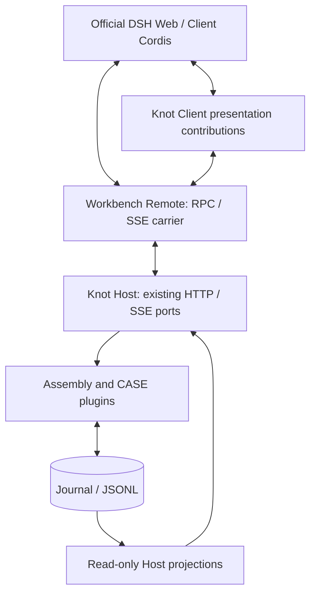

# Knot Run — official DSH frontend integration

Status: B1–B5 and S1–S5 are connected; attachments, command lifecycle and queue/steer delivery are added (2026-10-06).
This is the default root Run frontend, still an Alpha integration rather than a full DSH feature clone.

We load the published **DeepSeek Harness `0.2.0-rc.1` Web shell and Client plugins**.
Client Cordis **`4.0.4`** is their presentation runtime. Knot remains the only Agent execution
backend. No DSH Host, AgentLoop, sandbox or tool execution service is activated.

The directory/package names still say `reference-fixture`; they are historical names,
not a statement that Workbench mode uses fake data.

## 1. Start the correct mode

Run these commands from the repository root with Node 22.18 or newer.

```sh
npm install
npm --prefix web-dsh-reference install

# Single-origin normal use: builds Host and shell, then serves both on 4317.
npm start

# Alternatively, development uses two terminals:

# Terminal 1 — Knot Host, port 4317
npm run workbench:api

# Terminal 2 — real Knot Sessions in the official shell
npm run dsh-reference:dev -- --port 4178 --strictPort
```

Open <http://127.0.0.1:4178/>. In **Settings → 模型 Provider**, configure a local
OpenAI-compatible or DeepSeek profile, then create a Session in **新建 Session**.
The native sidebar New action uses Host defaults. A first visit without saved selection
can also create a blank default Session; it does not start a model request or precommit
inference/approval facts. Creating a writable Session requires a configured Provider.
Search Provider availability is currently assembled at Host startup. After adding the first DeepSeek profile through the UI,
restart the Host if you want `web_search`; there is no live tool-assembly reload.

To change the API development proxy target:

```sh
VITE_KNOT_DSH_MODE=workbench KNOT_WORKBENCH_URL=http://127.0.0.1:4320 \
  npm run dsh-reference:dev -- --port 4178 --strictPort
```

The Vite proxy is a development configuration, **not** a production deployment proxy.
`npm start` serves the built shell and API from one Host, including the native binary-upload route.
It is not packaged as an Electron app. No key is needed to open configuration; model calls need a configured Provider.

### Fixture mode — explicitly separate

```sh
VITE_KNOT_DSH_MODE=fixture npm run dsh-reference:dev -- --port 4175 --strictPort
```

Open <http://127.0.0.1:4175/>. Only the explicit Fixture switch lets `RemoteMock` supply
captured DSH fixture responses. This mode is useful for native UI comparison, not for
running Knot tools. Fixture images and other demonstrations do not imply Knot supports them.

The earlier Knot Web remains available through `npm --prefix web install` followed by
`npm run web:build` and `KNOT_WEB_ROOT=web/dist npm run workbench:api`, at port 4317. Do not start a second Host on an occupied port.

## 2. Architecture and ownership



| Module | Sole ownership | Does not own |
|---|---|---|
| `vite.config.ts` | Derive the official browser plugin graph from package manifests; load/copy official artifacts and local contributions | Agent assembly or DSH Host execution |
| `workbench-remote.ts` | Map DSH RPCs to Knot HTTP; follow SSE; reconcile snapshots; ephemeral receipts/interaction ids | Tool execution, approval policy, another persistent Session store |
| `knot-journal-projection.ts` | Translate recorded facts to native turns, steps and projections | Rewriting JSONL or attributing unobserved handler effects |
| `generation-projection.ts` / `interaction-projection.ts` | Disposable stream frames and approval/Ask presentation | Persisting token deltas or inventing cancellation |
| `tool-presentation.ts` | Translate native card fields and display aliases | Changing actual tool names, arguments, results or model context |
| `*-client.tsx` / `readonly-client.ts` | Register native slots/views and narrowly wrap original components | Calling CASE plugins or creating business facts directly |
| Host inspection projections | Reconstruct input; count recorded tools/subscription matches; project Session cover | Model calls, tool effects or parallel business state |

No official UI component source is forked into this directory. Official built artifacts
are copied into build output; the source carrier for Fixture mode is adapted from the MIT
assembled-client test seam. See [NOTICE](NOTICE.md) and [license](DSH-LICENSE.txt).

Dependencies point toward the presentation adapter: the Knot Host has no DSH UI dependency,
and CASE/Journal code has not changed for this integration. Browser imports of Host DTOs
are type-only, except a shared pure `session-facts.ts` projection with no Node dependencies.

This is **version-coupled**, not dependency-free. Slot wrappers retain original injection,
hooks and styles, but depend on rc.1 props, projection keys and public navigation contracts.
Some seams use `any`; upgrading DSH requires regression tests, not just changing versions.

### Installed packages versus executed backend

There are 9 direct production dependencies. The current lockfile contains 266 DeepSeek
package entries: aggregate `dsh-base` / `dsh-web-app` dependencies also install backend
packages. The loader selects Web Client declarations only. Thus **execution isolation is
achieved; installation slimming is not**. Workbench-mode build checks found no captured
Fixture strings or Mock-carrier marker; static source imports should not be mistaken for
an active Fixture backend.

## 3. Connected behavior and intentional limits

### Sessions and configuration

- Native Chat, Trajectory, sidebar activity and parent/child navigation use Knot snapshots.
  Activity comes from recorded/Host timestamps, not browser refresh time.
- Settings provides Provider list/add/edit/test/delete/default and Session creation.
  Environment profiles are read-only. Keys are sent only to the Host, never returned,
  saved in browser storage or copied into the Journal. Testing is a confirmed real request.
- Separate anchored native `Menu` controls select model/effort and approval. Their
  capability owner is Knot, not DSH settings/credential/model-directory services.
- Idle configuration changes remain pending. The next submit commits changed
  `inference.configured` / `approval.policy.configured`; unchanged values are not repeated.
  A Session's Assembly is not switched by these controls.
- Read-only Sessions remain read-only. Unconnected writes return `knot/unconnected`.
  Global discovery of Sessions created elsewhere still needs Refresh.

### Online execution and user interaction

- Native composer preserves DSH's queue/steer preference and shortcuts. Steering enters the running turn;
  follow-up stays in the Host FIFO until the current turn completes. Native QueueDock supports edit/remove/promote.
  Unsubmitted input is not in Journal and is not recovered after Host exit. Model failure retains, but does not auto-run, queued input.
  Inbox-only updates arrive directly over SSE, without rereading full Journal. Because native inbox normally uses a durable-log watermark,
  a version-checked Session Client extension accepts the Host's queue epoch/revision while retaining the original log seq (see NOTICE).
- Reasoning, content and tool arguments stream without becoming Journal delta events.
  Final recorded content reconciles optimistic echoes and settles the display once.
- Native Stop means **graceful pause after the current event**, not process abort. The
  same primary button resumes a paused run while preserving the unsent draft.
  A version-checked build extension adds only that primary action's label, icon and callback;
  native editor/layout/shortcuts remain in use (see NOTICE).
- New `llm.generated.timing` records client-observed duration and, for streaming calls,
  time to the first nonempty reasoning/text/tool output. Native views derive decode rate
  from output tokens and duration minus TTFT; old logs without timing stay unknown.
  No stream chunks or separately stored throughput are fabricated.
- Native approval and Ask keep Host broker ownership. Allow/reject means one decision,
  not a persistent permission grant. Auto approval is neither review nor a sandbox.
- Ask supports one question, optional choices and free text. Unsupported close/skip or
  multi-select outcomes return errors and leave the question answerable.
- Pending interactions replay on reconnect; Host settlement events retire answered cards.
  Disposing the UI never grants approval or answers a question.
- Journal invalidations are coalesced: one queued/in-flight read plus at most one trailing
  reconciliation. Stream frames stay ordered. The controlled 1,200-event test receives
  101 invalidations during a read and performs two reads, retaining all 100 deltas.
- Lost transient prefixes cannot be reconstructed: refresh repairs committed history,
  not missing live tokens/stdout. Switching away does not cancel the underlying command.

### Native cards and business projections

- Read/write/edit/Bash/search and alias tool cards reuse original native views. Read uses
  actual page line numbers; known Bash output/exits feed the native terminal. CASE1 CLI
  results and unknown exits retain generic fallback, never an inferred zero exit code.
- Runtime Bash stdout/stderr still use a small transient dock: the native running
  terminal does not accept this delta port. Captured stdout plus stderr does not claim
  their chronological interleaving.
- Write previews describe intended input. No applied full-file edit diff or historical
  Todo diff is fabricated. Raw Journal, Context and tool names remain unchanged.
- Search keeps provider source order. `truncated: false` means Knot imposed no list cap,
  not that upstream search is exhaustive. No absent dates/generated answers are invented.
- `todos` feeds the native Todo panel. Goal uses the unchanged native `GoalBar` as a
  read-only view, with mutations hidden/inert; DSH GoalService is not activated.
- Native turn/step statistics append the Journal event count. Usage includes recorded
  compaction calls; unknown/partial counts stay labelled. Output rate is invoke→generated
  **end-to-end** rate, not native decode TPS.

### S4–S5: independent read-only views

These are sibling native `conversation.view` contributions, not nested dashboards:

| View | Data and limits |
|---|---|
| Knot Inspector | Raw facts, filter, latest-100 pagination and lazy native JsonTree |
| Tool analytics | Full registry history including zero-call/removed tools; call share and explicit-result success rate; unknown/unfinished separate |
| Context analysis | Selected historical `llm.invoke`, canonical messages/tools, manifest and bounded sources; composition in UTF-16 characters, not invented segment tokens |
| Plugins / protocols | Current executable Assembly metadata; declared input/subscription matches, not handler executions or recorded output attribution |
| Session cover | Deterministic SVG identity, workspace/configuration, timestamps, Usage, Todo/Goal, original latest-reply excerpt and searchable Query directory |

Cover queries include Steering, so they are not equivalent to completed native turns.
It reuses native per-Session view preferences: sending enters Chat; selecting a query uses
the native semantic scroll port. No model-generated summary, cover image request, new
Journal event, child-usage rollup or second metadata store is introduced. Composer remains
shared across tabs, including inspection/cover; its resize/visibility behavior is native.

Host read routes are under `/api/workbench/sessions/:id/`: `context`, `cover`,
`analytics/tools`, and `analytics/plugins`. Carrier `knot/*` methods forward their DTOs.
Tool links focus call/result facts; Context and tool views can export local JSON.

## 4. Remaining deviation ledger

Recovery audit (2026-10-06): loading a Session does not replay old tool effects, but a tool-call batch with missing results
still projects an invalid next model request. Strict validation and a real DeepSeek request reproduce the HTTP 400.
The complete-results control passes. `test/recovery-audit.test.ts` characterizes this gap; it does not repair it.
No automatic rerun, invented success result or historical rewrite is implemented. The unknown-result policy needs review.

Dependency audit at this checkpoint: root production dependencies report no advisory; the frontend dependency tree reports
one high-severity `http-cache-semantics` advisory and four moderate advisories. This is a dependency report, not proof of an
activated vulnerable Knot path. Review/update upstream dependencies before a broader release; no forced upgrade was applied.

| Root cause | Current difference | Treatment |
|---|---|---|
| Product semantics | Graceful pause, auto approval, one-question Ask, independent persistent children, read-only Goal | Keep explicit; only expand with an agreed CASE requirement |
| Presentation/wiring | Custom Provider/New Session forms; live Bash dock; native component wrappers | Prefer native primitives/slots; do not create a second business service |
| Knot extension | Inspection and cover layout, partial custom i18n | Small usage-driven iteration; no claim of 1:1 DSH styling |
| Missing facts | Historical TTFT/decode, old cache counts, applied edit diffs, lost stream prefixes | Unknown/unavailable, never fabricated |
| Unconnected capabilities | Fork, full Jobs/Plan, dynamic Cordis, sandbox presets | Hidden or explicitly refused; attachments and session rename/archive/pin are connected |
| Needs measurement | Reported approval-layout flashes and stream smoothness | Reproduce/profile before optimizing; tests do not prove rendering speed |
| Maintenance | Aggregate dependency weight; historical names; two frontend entry points | Separate bounded cleanup; no kernel/CASE redesign |

S1–S5 complete the agreed integration batches, **not** the whole proposed inspection roadmap,
DSH four-mode parity, Studio editor, plugin ecosystem or production deployment.

## 5. Verification and owned code footprint

At `91f2200`: root **147 tests**, Client **32 tests**, and Workbench-mode build pass.
These validate contracts/reconciliation, not every pixel or browser performance.

```sh
npm test
npm --prefix web-dsh-reference test
npm run dsh-reference:build
# Optional separate Fixture build
VITE_KNOT_DSH_MODE=fixture npm run dsh-reference:build
```

Disposable, model-free browser smoke Hosts:

```sh
npm run build
node web-dsh-reference/test/interaction-host.mjs
# Or, separately:
node web-dsh-reference/test/cover-host.mjs
```

Each script prints its address/instructions. Use `KNOT_WORKBENCH_URL` to connect the frontend.
These exercise real HTTP/UI ports without real model requests or user Session mutations.

Historical acceptance evidence, not repeatedly rerun benchmarks:

- B4 isolated real DeepSeek Session: 2 turns, 5 model calls, 34 facts, 8,727 request tokens,
  73.4% input-cache hit; read → approval → Ask → final → pause/resume; no repository changes.
- B5/S4 saved coding Session: 1,134 facts; 207 tool calls/returns, two explicit failures,
  no unfinished calls. Its persisted child opens with the parent breadcrumb.
- Inspection follow-up: saved `B2 configuration smoke`, 288 facts; 9 registered tools,
  69 calls, 7 unused tools, Bash share 66.67%, explicit-result success 97.83%.
- S5: model-free cover/HTTP/native-navigation tests and browser smoke; no new real LLM call.

Physical lines, including comments/blanks; baseline `2b7c94c` → `91f2200`:

| Owned scope | Lines |
|---|---:|
| Production Client/carrier/projections/styles | 1,730 |
| Build wiring | 261 |
| Host net addition | 288 |
| **Production total** | **2,279** |
| New tests and smoke scripts | 1,220 |
| Separate Fixture carrier / captured JSON | 490 / 5,778 |

Official dependency code, lockfile, docs and earlier Knot Web are excluded. These are
maintenance-scope counts, not the size of an independently implemented complete frontend.
